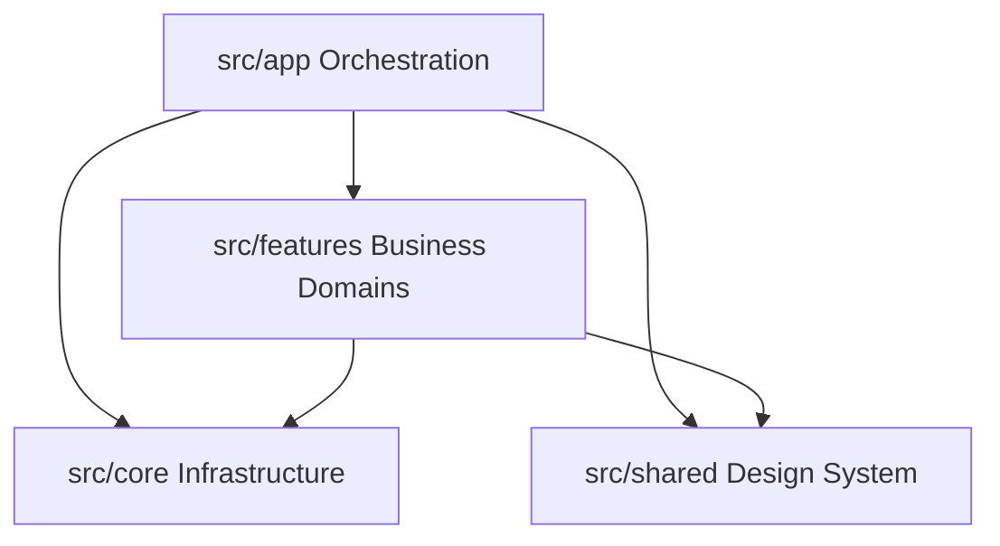

# Architectural Dependency Rules

## 1. Core Dependency Axiom

Software architectures degrade when boundaries are porous. To guarantee longevity and avoid spaghetti coupling among 19 business domains, all engineers and automated linters must enforce these directional rules.

---

## 2. Permitted Import Paths



- **`app → core`**: The application layer initializes core services (Tenant resolution, Auth guards, HTTP client defaults).
- **`app → shared`**: Application layouts and shells consume shared UI components (Button, Header, PageHeader).
- **`app → features`**: The router inside `app` imports domain page entries to expose them under routes.
- **`features → core`**: Feature domain components read tenant context, user roles, and consume standard API client types.
- **`features → shared`**: Feature components assemble their UI using shared buttons, cards, modals, and formatters.

---

## 3. Strictly Prohibited Import Paths

```
[STRICTLY PROHIBITED]
  core     ──✕──> features
  shared   ──✕──> features
  features ──✕──> app
  featureA ──✕──> featureB (deep internal imports)
```

### Detailed Prohibitions:

1. **`core → features`**:  
   The core layer represents pure technical infrastructure. It must never know what an "Employee", "Lead", or "Invoice" is.
2. **`shared → features`**:  
   The shared folder contains domain-agnostic utilities and design system components. Putting domain logic into shared causes untracked coupling.
3. **`features → app`**:  
   Domain folders must never import application layouts, route definitions, or app bootstrapping.
4. **Deep cross-feature imports (`features/hrms` → `features/finance/internal/...`)**:  
   Domains must be strictly isolated. Cross-domain data sharing must occur through approved core events or orchestration in `app`.
5. **Direct Database or Arbitrary API Calls**:  
   Features must not bypass the standard HTTP client or create arbitrary unauthenticated network calls.
